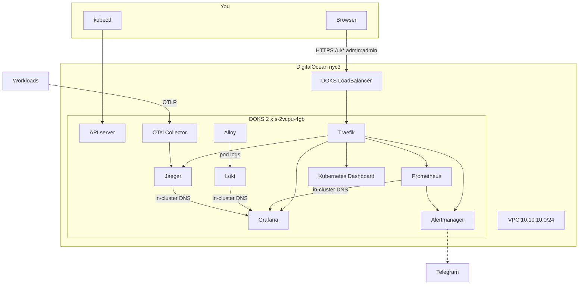

# Architecture

How the lab is wired. How to run it: [README.md](./README.md).

## Layers

1. **Terraform** — VPC + DOKS. State in Spaces. [terraform/README.md](./terraform/README.md)
2. **Helmfile** — Traefik, Dashboard, kube-prometheus-stack, Loki, Alloy, Jaeger, OTel. [helmfile/README.md](./helmfile/README.md)
3. **Edge** — one LB, path prefix `/ui/<service>`, shared basic auth except Kubernetes Dashboard (cookie gate)

Grafana datasources (Prometheus, Loki, Jaeger, Alertmanager) use Service DNS, so a new LB IP does not break them.

## Not in this stand

- Control-plane or app HA
- Persistent Jaeger (no OpenSearch / Cassandra)
- Kubecost / FinOps dashboards (use the DigitalOcean billing page)
- SLO burn alerts, chaos reports, incident write-ups
