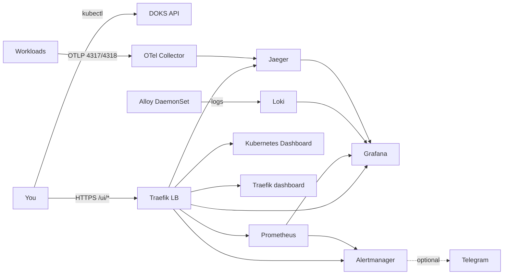

# k8s-observability-sre-lab

A small **DigitalOcean Kubernetes (DOKS)** lab that deploys a full observability stack: metrics, logs, traces, dashboards, and alerts.

Terraform creates the cluster. Helmfile installs the apps. After that you use `kubectl` as usual and open the UIs on one Traefik load balancer.

| | |
|---|---|
| Cloud | DigitalOcean / DOKS (`nyc3`) |
| Nodes | 2 × `s-2vcpu-4gb`, Kubernetes `1.35.7`, control-plane HA off |
| Edge | Traefik `LoadBalancer` — `https://<lb-ip>/ui/<service>` |
| Login | `admin` / `admin` (see [User interfaces](#user-interfaces)) |

Detailed install steps: [terraform/README.md](./terraform/README.md) · [helmfile/README.md](./helmfile/README.md). Diagram: [ARCHITECTURE.md](./ARCHITECTURE.md).

## What you get

A working Kubernetes cluster plus:

- **Metrics** — Prometheus + Grafana (kube-prometheus-stack)
- **Logs** — Loki + Grafana Alloy
- **Traces** — OpenTelemetry Collector → Jaeger
- **Alerts** — Alertmanager (optional Telegram), per-service `*Down` rules, and demo-load SLO (`DemoLoadErrorRateSLOBreach`)
- **Cluster UI** — official Kubernetes Dashboard
- **Load-proof** — tiny demo + k6 in [`for-load-test/`](./for-load-test/) (app hurts → metrics / logs / traces / SLO)

This is a lab, not HA production. Replicas stay at 1 so the stack fits two 4 GiB nodes. Jaeger keeps traces in memory.


## Screenshots

See [`demo/`](./demo/) — one folder per service (Grafana dashboards and, where it exists, the service UI).

## Architecture



Traffic between Grafana and the backends uses in-cluster DNS (`*.svc.cluster.local`), not the public IP.

## User interfaces

Replace `<lb-ip>` with the Traefik Service address:

```bash
kubectl -n traefik get svc traefik
```

**Public base URL (one place):** [`helmfile/values/lab.yaml`](./helmfile/values/lab.yaml) → `lab.publicBaseURL` (scheme + host, no trailing slash). This is the Traefik LoadBalancer IP **or future DNS**. Grafana `root_url`, Prometheus/Alertmanager `externalUrl`, and links in runbook/SLO dashboards all use it. When the LB is recreated, update that file and `helmfile sync` — do not scatter the IP in JSON.

Current value: `https://134.199.251.14` (will change if the LB is recreated).

| UI | URL | Auth |
|---|---|---|
| Grafana | `https://<lb-ip>/ui/grafana` | `admin` / `admin` (Traefik basic auth; Grafana form is off) |
| Prometheus | `https://<lb-ip>/ui/prometheus` | same |
| Alertmanager | `https://<lb-ip>/ui/alertmanager` | same |
| Jaeger | `https://<lb-ip>/ui/jaeger` | same |
| Traefik | `https://<lb-ip>/ui/traefik` | same |
| Kubernetes Dashboard | `https://<lb-ip>/ui/kubernetes-dashboard` | `admin` / `admin` once (cookie gate, not Traefik basic auth) |

The certificate is Traefik's default self-signed one — accept the browser warning.

Loki has no public UI. Query logs from Grafana (folder `loki`). Alloy writes to `http://loki.loki.svc.cluster.local:3100`.

## Repository layout

```
terraform/      # VPC + DOKS. State in DigitalOcean Spaces.
helmfile/       # Vendored charts, values, dashboards, alerts. One helmfile sync.
                # Public UI host: helmfile/values/lab.yaml (lab.publicBaseURL).
for-load-test/  # Demo app + k6 to prove metrics/logs/traces on the stack.
ARCHITECTURE.md
```

Secrets stay out of git: `terraform.tfvars`, `kubeconfig`, `helmfile/values/**/*.local.yaml`.

## Prerequisites

- DigitalOcean account and API token
- Spaces access key (remote Terraform state)
- Terraform >= 1.5
- `kubectl`, `helm`, `helmfile`
- Optional: Telegram bot token for Alertmanager

## Quick start

### 1. Cluster

Follow [terraform/README.md](./terraform/README.md). When `terraform apply` finishes:

```bash
terraform -chdir=terraform output -raw kubeconfig > kubeconfig
export KUBECONFIG=$PWD/kubeconfig
kubectl get nodes
```

You should see two Ready nodes.

### 2. Observability stack

```bash
helmfile -f helmfile/helmfile.yaml sync
```

That installs Traefik, Kubernetes Dashboard, Prometheus, Grafana, Alertmanager, Loki, Alloy, Jaeger, and the OpenTelemetry Collector. Charts are vendored (`skipDeps`). Details: [helmfile/README.md](./helmfile/README.md).

### 3. Open a UI

```bash
kubectl -n traefik get svc traefik
# then https://<EXTERNAL-IP>/ui/grafana  (admin / admin)
```

## Short demo

About two minutes, after `helmfile sync`:

1. Grafana → folder `k8s` → **Node Exporter / Nodes** — CPU/memory for both Droplets.
2. Folder `loki` → **K8s App Logs** — pick a namespace, you should see pod lines from Alloy.
3. Folder `traefik` → **Traefik Ingress** — request rates on the path-prefix routes.
4. `https://<lb-ip>/ui/jaeger` → search service `devo-smoke` (or send any OTLP to `opentelemetry-collector:4318`).
5. `https://<lb-ip>/ui/prometheus` → **Alerts** — lab `*Down` rules stay inactive while targets are up.
6. Grafana → folder `slo` → **SLA / SLO / SLI — demo-load** after k6: error rate ~5% (SLO is **< 1%**, so `DemoLoadErrorRateSLOBreach` fires). Folder **Runbooks** has the matching text runbook. Stop the Job and watch SLI recover.

## Tear down

Uninstall apps first so DigitalOcean does not leave orphan disks / the LB:

```bash
helmfile -f helmfile/helmfile.yaml destroy
terraform -chdir=terraform destroy
terraform -chdir=terraform/bootstrap destroy   # Spaces bucket, last
```

## License

Use it as a portfolio / learning stand. Do not commit tokens or `terraform.tfvars`.
