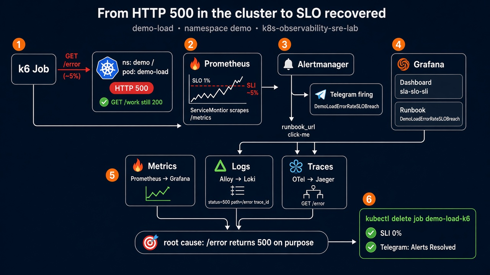

# SLA incident: `DemoLoadErrorRateSLOBreach`

Данный стенд — это решение, как отслеживать и поддерживать SLA/SLO проекта.

Стенд полностью описан кодом: Kubernetes в DigitalOcean Cloud с настроенным monitoring stack для наблюдения за сервисами и быстрой реакции на инциденты.

Ниже — кейс, когда web-приложение внутри Kubernetes начинает отвечать ошибками с кодом 500. Для быстрой реакции на такой и подобные инциденты реализована система мониторинга:

1. **Grafana + Prometheus** — собирают и отображают метрики со всего, что развёрнуто в Kubernetes, через дашборды, в том числе SLA/SLO/SLI.
2. **Alertmanager** — уведомления по критическим метрикам и сообщение в Telegram со всей информацией, нужной инженеру для быстрой реакции.
3. **Loki** — собирает и отображает логи всех сервисов. Во время инцидента можно сразу разобрать ошибки приложения.
4. **Jaeger** — собирает и отображает traces. При расследовании видно, какой именно запрос не выполняется.

Ниже — путь, который проходит инженер, реагируя на инцидент: получает уведомление о нарушении SLO, по стеку мониторинга выясняет причину и чинит её, затем получает уведомление, что инцидент закрыт.



Приложение: [`for-load-test/`](../../for-load-test/) (`demo-load` в namespace `demo`). В смеси k6 около **5% `GET /error`** — этого достаточно, чтобы пробить **SLO 1% error rate**. Это не падение пода: `/error` специально отвечает HTTP 500.

## Содержание

- [Как поднять стенд](#как-поднять-стенд)
- [Как связаны сигналы](#как-связаны-сигналы)
- [Как воспроизвести инцидент](#как-воспроизвести-инцидент)
- [Шаг 1 — SLO dashboard: SLI выше SLO](#шаг-1--slo-dashboard-sli-выше-slo)
- [Шаг 2 — Алерт (Telegram / Alertmanager)](#шаг-2--алерт-telegram--alertmanager)
- [Шаг 3 — Runbook](#шаг-3--runbook)
- [Шаг 4 — Логи (Loki)](#шаг-4--логи-loki)
- [Шаг 5 — Трейсы (Jaeger)](#шаг-5--трейсы-jaeger)
- [Шаг 6 — Починка и recover](#шаг-6--починка-и-recover)
- [Кратко](#кратко)

## Как поднять стенд

1. Стек наблюдаемости:

   ```bash
   helmfile -f helmfile/helmfile.yaml sync
   ```

2. `lab.publicBaseURL` в [`helmfile/values/lab.yaml`](../../helmfile/values/lab.yaml) совпадает с Traefik LoadBalancer (`scheme + host`, без trailing slash). Из этого значения берутся Grafana `root_url`, Prometheus / Alertmanager `externalUrl`, ссылки в runbook и `runbook_url` в PrometheusRule. IP балансировщика в дашборды руками не копировать.

   ```bash
   kubectl -n traefik get svc traefik
   # if the EXTERNAL-IP changed: edit lab.yaml, then helmfile sync
   ```

3. `demo-load` задеплоен (ServiceMonitor снимает kube-prometheus-stack):

   ```bash
   kubectl apply -k for-load-test
   kubectl -n demo rollout status deploy/demo-load --timeout=5m
   ```

4. Логин: `admin` / `admin`. UI: `https://<lb-ip>/ui/<service>` (тот же host, что в `lab.publicBaseURL`).

Опционально: Telegram в Alertmanager (`helmfile/values/kube-prometheus-stack/telegram.local.yaml`). Без него смотрите Alertmanager / Prometheus Alerts.

## Как связаны сигналы

| Сигнал | Путь |
|---|---|
| Метрики (SLI) | `demo-load` `/metrics` → Prometheus Operator **ServiceMonitor** `demo/demo-load` → Prometheus → Grafana, папка `sla-slo-sli` |
| Логи | JSON stdout (`path`, `status`, `trace_id`) → Grafana **Alloy** → **Loki** → Grafana |
| Трейсы | приложение OTLP HTTP **4318** → OpenTelemetry Collector → **Jaeger** (in-memory) |

Коллектор в этой лабе только для traces. Логи подов уже снимает Alloy. Второй коллектор ставить не нужно.

**SLI** (5 минут):

```promql
sum(rate(demo_http_requests_total{namespace="demo",code=~"5.."}[5m]))
/
clamp_min(sum(rate(demo_http_requests_total{namespace="demo"}[5m])), 1e-9)
```

**SLO:** эта доля **< 1%**. Алерт `DemoLoadErrorRateSLOBreach` (`helmfile/alerts/demo/slo.yaml`) срабатывает, если она держится **> 0.01** дольше **1m**.

## Как воспроизвести инцидент

```bash
kubectl -n demo delete job demo-load-k6 --ignore-not-found
kubectl apply -k for-load-test/k6
kubectl -n demo logs -f job/demo-load-k6
```

Job в кластере (~3 мин): ~80% `/work`, ~15% `/slow`, ~5% `/error`. k6 с хоста описан в [`for-load-test/README.md`](../../for-load-test/README.md).

После появления 5xx подождите около минуты, чтобы сработал `for: 1m`.

---

## Шаг 1 — SLO dashboard: SLI выше SLO

Это общий дашборд, в котором описаны SLA/SLO/SLI для конкретного сервиса — в примере это `demo-load`. Он показывает фактические показатели SLI постоянно: по нему сразу видно, выполняются обязательства или нет.

Пока крутится нагрузка, SLI (error rate за 5 минут) оказывается **выше** красной линии **1%**, error budget уходит в минус. Это и есть сигнал, что внешнее обещание сервиса уже под ударом.


## Шаг 2 — Алерт (Telegram / Alertmanager)

Инженер получает уведомление в удобный мессенджер — в примере это Telegram — с краткой сводкой: что случилось, какая метрика, где лежит runbook (как чинить и куда смотреть) и ссылка на эту метрику в Prometheus. За минимальное время это даёт весь нужный контекст, чтобы чинить инцидент, а не собирать его по кускам.


## Шаг 3 — Runbook

Из алерта инженер открывает runbook: это короткая инструкция именно по этому SLO, а не общая wiki. В ней уже написано, какой дашборд смотреть, как найти ошибку в логах, как выйти на трейс и чем заканчивается починка. Не нужно вспоминать, «куда вообще ходить».


## Шаг 4 — Логи (Loki)

Пока инцидент живой, в Loki видны логи приложения: статус **500**, путь **`/error`**, и в той же JSON-строке **`trace_id`**. Это ответ на вопрос «что именно падает прямо сейчас», без `kubectl logs` по подам.


## Шаг 5 — Трейсы (Jaeger)

`trace_id` из лога открывается в Jaeger: видно, что ломается конкретный запрос **`GET /error`**, а соседние `GET /work` / `GET /slow` отрабатывают. Так инженер отделяет «сервис лёг» от «одна ручка специально отдаёт 500».


## Шаг 6 — Починка и recover

Причину устраняем (в этом кейсе — останавливаем нагрузку k6). Приложение остаётся в кластере, 5xx пропадают, SLI возвращается **ниже 1%**, error budget снова зелёный. Инженер получает уведомление, что инцидент закрыт.

```bash
kubectl -n demo delete job demo-load-k6
```


Когда закончите со стендом: `kubectl delete -k for-load-test` (см. [`for-load-test/README.md`](../../for-load-test/README.md)).

---

## Кратко

1. Стенд: `helmfile sync`, `lab.publicBaseURL`, `kubectl apply -k for-load-test`.
2. Нагрузка: `kubectl apply -k for-load-test/k6` (~5% `GET /error`).
3. Дашборд SLA/SLO/SLI: SLI выше 1% — обязательства не держатся.
4. Telegram: сводка, runbook, ссылка на метрику.
5. Runbook: куда смотреть и как чинить.
6. Loki: ошибки приложения и `trace_id`.
7. Jaeger: какой запрос не выполняется (`GET /error`).
8. Снять нагрузку → SLI < 1% и уведомление, что инцидент закрыт.
