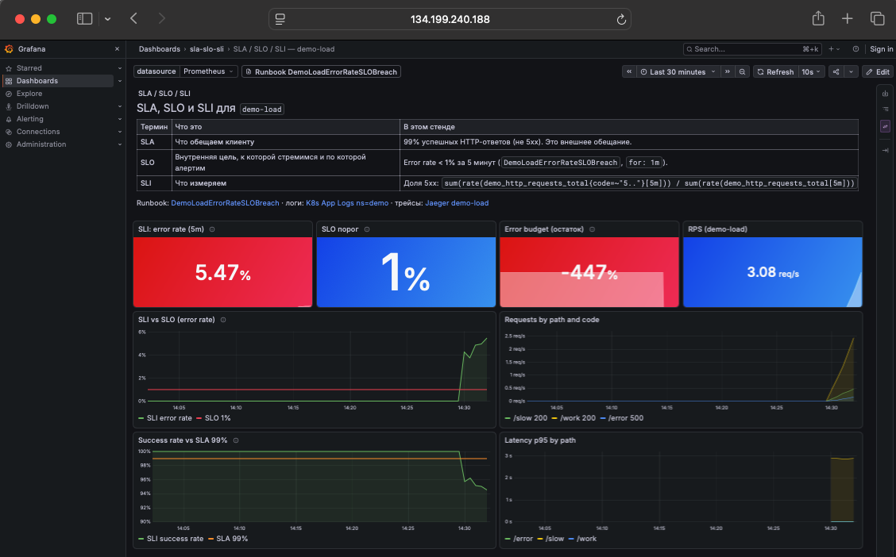
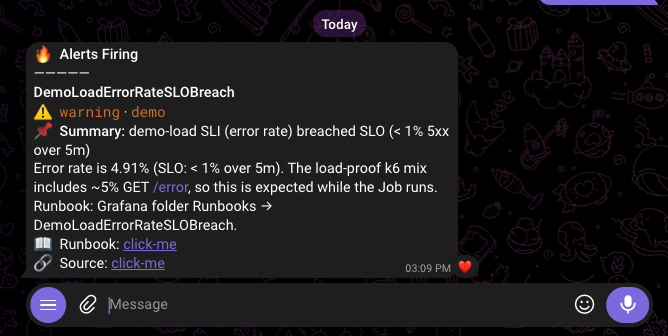
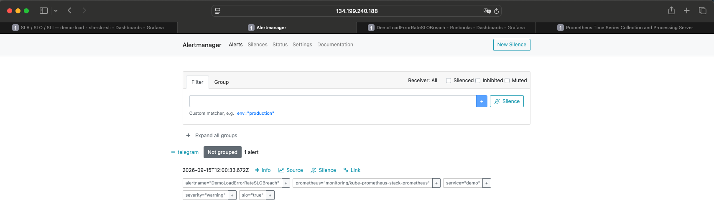
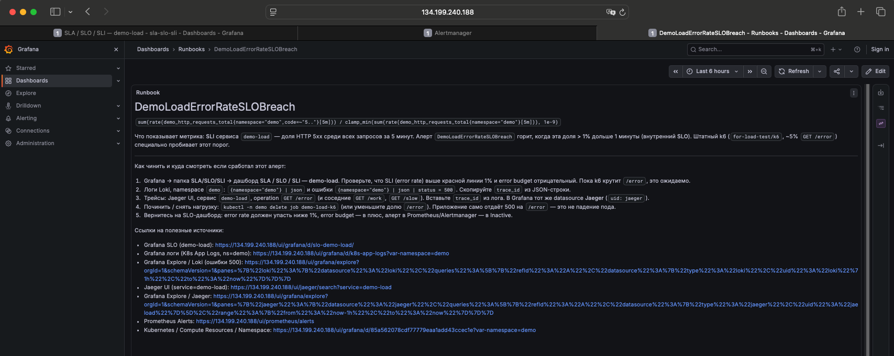
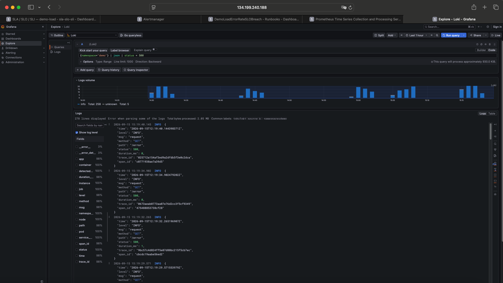
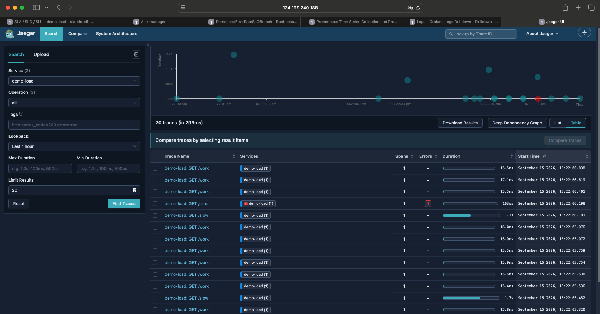
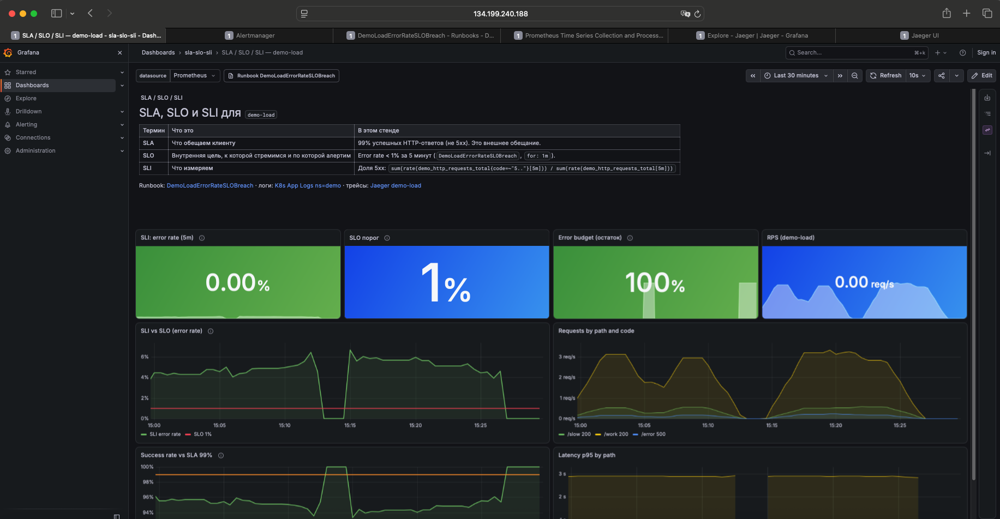

# SLA incident: `DemoLoadErrorRateSLOBreach`

This lab is a working answer to how you track and hold a project's SLA/SLO.

The lab is fully described as code: Kubernetes on DigitalOcean Cloud with a monitoring stack configured so you can watch services and react to incidents quickly.

Below is a case where a web application inside Kubernetes starts answering with HTTP 500. For fast reaction to this and similar incidents, the monitoring system is:

1. **Grafana + Prometheus** — collect and display metrics from everything deployed in Kubernetes, through dashboards, including SLA/SLO/SLI.
2. **Alertmanager** — notifications on critical metrics and a Telegram message with everything an engineer needs to react quickly.
3. **Loki** — collects and displays logs from all services. During an incident you can immediately work through application errors.
4. **Jaeger** — collects and displays traces. During investigation you can see which exact request is failing.

Below is the path an engineer takes while responding to an incident: they get a notification that the SLO is breached, use the monitoring stack to find the cause and fix it, then get a notification that the incident is closed.


Application: [`for-load-test/`](../../for-load-test/) (`demo-load` in namespace `demo`). In the k6 mix about **5% `GET /error`** — enough to breach the **SLO 1% error rate**. This is not a pod crash: `/error` deliberately answers HTTP 500.

## Contents

- [How to bring up the lab](#how-to-bring-up-the-lab)
- [How the signals connect](#how-the-signals-connect)
- [How to reproduce the incident](#how-to-reproduce-the-incident)
- [Step 1 — SLO dashboard: SLI above SLO](#step-1--slo-dashboard-sli-above-slo)
- [Step 2 — Alert (Telegram / Alertmanager)](#step-2--alert-telegram--alertmanager)
- [Step 3 — Runbook](#step-3--runbook)
- [Step 4 — Logs (Loki)](#step-4--logs-loki)
- [Step 5 — Traces (Jaeger)](#step-5--traces-jaeger)
- [Step 6 — Fix and recover](#step-6--fix-and-recover)
- [In short](#in-short)

## How to bring up the lab

1. Observability stack:

   ```bash
   helmfile -f helmfile/helmfile.yaml sync
   ```

2. `lab.publicBaseURL` in [`helmfile/values/lab.yaml`](../../helmfile/values/lab.yaml) matches the Traefik LoadBalancer (`scheme + host`, no trailing slash). Grafana `root_url`, Prometheus / Alertmanager `externalUrl`, runbook links, and `runbook_url` in the PrometheusRule are taken from this value. Do not copy the balancer IP into dashboards by hand.

   ```bash
   kubectl -n traefik get svc traefik
   # if the EXTERNAL-IP changed: edit lab.yaml, then helmfile sync
   ```

3. `demo-load` is deployed (ServiceMonitor is scraped by kube-prometheus-stack):

   ```bash
   kubectl apply -k for-load-test
   kubectl -n demo rollout status deploy/demo-load --timeout=5m
   ```

4. Login: `admin` / `admin`. UI: `https://<lb-ip>/ui/<service>` (the same host as in `lab.publicBaseURL`).

Optional: Telegram in Alertmanager (`helmfile/values/kube-prometheus-stack/telegram.local.yaml`). Without it, use Alertmanager / Prometheus Alerts.

## How the signals connect

| Signal | Path |
|---|---|
| Metrics (SLI) | `demo-load` `/metrics` → Prometheus Operator **ServiceMonitor** `demo/demo-load` → Prometheus → Grafana, folder `sla-slo-sli` |
| Logs | JSON stdout (`path`, `status`, `trace_id`) → Grafana **Alloy** → **Loki** → Grafana |
| Traces | application OTLP HTTP **4318** → OpenTelemetry Collector → **Jaeger** (in-memory) |

The collector in this lab is for traces only. Pod logs are already scraped by Alloy. You do not need a second collector.

**SLI** (5 minutes):

```promql
sum(rate(demo_http_requests_total{namespace="demo",code=~"5.."}[5m]))
/
clamp_min(sum(rate(demo_http_requests_total{namespace="demo"}[5m])), 1e-9)
```

**SLO:** this ratio **< 1%**. Alert `DemoLoadErrorRateSLOBreach` (`helmfile/alerts/demo/slo.yaml`) fires if it stays **> 0.01** for longer than **1m**.

## How to reproduce the incident

```bash
kubectl -n demo delete job demo-load-k6 --ignore-not-found
kubectl apply -k for-load-test/k6
kubectl -n demo logs -f job/demo-load-k6
```

Job in the cluster (~3 min): ~80% `/work`, ~15% `/slow`, ~5% `/error`. k6 from the host is described in [`for-load-test/README.md`](../../for-load-test/README.md).

After 5xx appear, wait about a minute so `for: 1m` can fire.

---

## Step 1 — SLO dashboard: SLI above SLO

This is a shared dashboard that describes SLA/SLO/SLI for a specific service — in the example that is `demo-load`. It shows actual SLI figures continuously: you can see at once whether the commitments hold.

While load is running, the SLI (5-minute error rate) sits **above** the red **1%** line, and the error budget goes negative. That is the signal that the service's external promise is already under pressure.



## Step 2 — Alert (Telegram / Alertmanager)

The engineer gets a notification in a convenient messenger — in the example that is Telegram — with a short summary: what happened, which metric, where the runbook lives (how to fix it and where to look), and a link to that metric in Prometheus. In the shortest possible time this gives all the context needed to fix the incident, rather than assembling it piece by piece.





## Step 3 — Runbook

From the alert the engineer opens the runbook: a short instruction for this SLO specifically, not a general wiki. It already says which dashboard to look at, how to find the error in logs, how to get to the trace, and what the fix looks like when it is done. No need to remember "where do I even go".



## Step 4 — Logs (Loki)

While the incident is live, Loki shows application logs: status **500**, path **`/error`**, and in the same JSON line **`trace_id`**. That answers "what exactly is failing right now", without `kubectl logs` across pods.



## Step 5 — Traces (Jaeger)

The `trace_id` from the log opens in Jaeger: you can see that the specific request **`GET /error`** is breaking, while neighboring `GET /work` / `GET /slow` succeed. That is how the engineer separates "the service is down" from "one handler deliberately returns 500".



## Step 6 — Fix and recover

We remove the cause (in this case — stop the k6 load). The application stays in the cluster, 5xx disappear, SLI returns **below 1%**, the error budget is green again. The engineer gets a notification that the incident is closed.

```bash
kubectl -n demo delete job demo-load-k6
```



When you are done with the lab: `kubectl delete -k for-load-test` (see [`for-load-test/README.md`](../../for-load-test/README.md)).

---

## In short

1. Lab: `helmfile sync`, `lab.publicBaseURL`, `kubectl apply -k for-load-test`.
2. Load: `kubectl apply -k for-load-test/k6` (~5% `GET /error`).
3. SLA/SLO/SLI dashboard: SLI above 1% — commitments are not holding.
4. Telegram: summary, runbook, link to the metric.
5. Runbook: where to look and how to fix.
6. Loki: application errors and `trace_id`.
7. Jaeger: which request is failing (`GET /error`).
8. Take the load off → SLI < 1% and a notification that the incident is closed.
